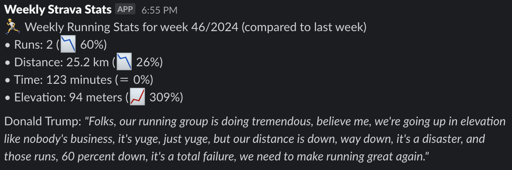

# Weekly Strava Running Stats

This python application is made to post weekly running stats from a Strava club to a Slack channel.


## Install

Clone the Repository:
```bash
git clone https://github.com/fleinen/Weekly-Strava-Stats-in-Slack.git
cd Weekly-Strava-Stats-in-Slack
```

Install the requirements:
```bash
# Ensure you have poetry installed
pip install poetry

poetry install
```

## Configure

### Strava Widget URL
Currently, the application uses the Strava widget to fetch the weekly running stats. To get the widget URL:
1. Go to https://www.strava.com/ and navigate to your club's page
1. Click on "Share Club Runs"
1. In the text box showing the code for the **Summary Widget**, copy the iframe's `src` url
1. This url must be set as an environment variable with the key `STRAVA_WIDGET_URL` which can be set in the `.env` file.

### Create and Configure a Slack App

Create the app:
1. Go to https://api.slack.com/apps
1. Click "Create New App"
1. Choose "From scratch"
1. Name the app (e.g., "Weekly Strava Running Stats")
1. Select workspace

Bot Permissions:
1. Go to "OAuth & Permissions" in left sidebar
1. Under "Bot Token Scopes", add:
 - chat:write

Install App to Workspace
1. Go to "OAuth & Permissions"
1. Click "Install to Workspace"
1. Authorize the app
1. Get Tokens
1. Copy "Bot User OAuth Token" (starts with xoxb-)
1. The token must be set as an environment variable with the key `SLACK_BOT_TOKEN` which can be set in the `.env` file.


### Add the App to a Channel

After installing the app to your workspace, open Slack.
In the channel where you want the bot to post:
1. Click the channel name at the top
1. Scroll down and copy the channel ID (starts with C)
1. The channel ID must be set as an environment variable with the key `SLACK_CHANNEL` which can be set in the `.env` file.
1. Select "Integrations"
1. Click "Add apps" and search for your app's name

### Setup Scheduled Jobs

The application provides two commands which should be working by now:
- `fetch-strava-stats` to fetch the weekly running stats from Strava.
- `post-last-weeks-stats` to post the stats to a Slack channel.
Both jobs can be configured to run on a schedule using a cron job:

To download data every day at 11:55 PM and post the stats every Monday at 8:30 AM, run `crontab -e` in a terminal and add:

```bash
55 23 * * * cd /path/to/Weekly-Strava-Stats-in-Slack && poetry run weekly-strava-stats fetch-strava-stats
30 8 * * 1 cd /path/to/Weekly-Strava-Stats-in-Slack && poetry run weekly-strava-stats post-last-weeks-stats
```

### Optional: Add a Groq API Key
There will be a quote at the end of every message. If a Groq API key is provided, it will be a fictional quote from commenting on the Strava stats. If not, it will be a random quote from a hardcoded list.

You can generte an API key [here](https://console.groq.com/keys). The key must be set as an environment variable with the key `GROQ_API_KEY` which can be set in the `.env` file.